except# Project 4 - Design & Plan

Be clear and concise in your writing. Bullets points are acceptable.


# Planning

## Client Description (Milestone 1)
> Tell us about your client. Who is your client? What kind of website do they want? What are their key goals?

Our client is Haven: Cornell's LGBT Student Union. The main purpose of Haven is to create spaces for LGBTQ+ education, community, and service. Within Haven, there are 11 sub-organizations, which have different purposes and/or are targeted to people of different identities. Haven has a website, but they asked us to design a new one rather than redesigning the existing site.

Existing site link: https://www.havencornell.com/

> NOTE: **If you are redesigning an existing website, give us the current URL and some screenshots of the current site.** Tell us how you plan to update the site in a significant way that meets the Project 4 requirements.


## Site's Purpose (Milestone 1)
> Tell us the purpose of the website and what it is all about.

They want a website where anyone can get basic information about what Haven is, and they want the website to show that they are a student organization that offers many different kinds of support for the community.

## Client Meeting Notes (Milestone 1)
> Include your notes/minutes from the client meeting, an email they sent you, or whatever you used to keep track of what was discussed at the meeting.

**What kind of website do you want?**

- Mostly informational, I would say.
- Not necessarily meant to be persuasive or sell anything
- Want to clarify their organizational structure, which is sometimes confusing because:
  - Sub-orgs
  - often confused with LGBT Resource Center, which is a separate entity
- Want to make it clear that it is a student organization rather than a business or university department

**What is the key message (~1 sentence)**

"Your fellow LGBTQ students have spaces and resources for you"

**Intended audience?**

- "Probably" LGBT students
- Other potential users: people who want to know what is available to LGBTQ students on Cornell's campus (e.g. prospective students and their families, new staff member learning about Cornell)

**What kind of things do you want people to be able to do on the website?**

- Did not know how to answer at first, had to give example
- "want to give people a starting point for action"
- get idea of what different things we do are and refer them to other contacts or pages if necessary (because some organizations do not want a lot of their information public)
- Learn about Haven events and sub-org events

Summary: want them to see information they need to participate in each sub-org and/or give contact information if some information is not publicly available for safety reasons

**Page for each sub-org?**
- Probably not because there are a lot of sub-orgs, but there should be information about each sub-org

**Are sub-orgs only part of Haven?**

- No, there is an overall e-board for Haven, and faculty advisors at the LGBT Resource Center

**Do you want to share info about e-board and general events as well?**

E-board information is more personal because many sub-orgs require privacy, want to show the e-board members in a way that makes them approachable so people feel comfortable getting involved

**Is there a formal membership in the organization?**

No, except for people with official leadership positions. Anyone who comes to an event we would consider a member, but there are no membership requirements.

**What interactive elements do you want on the website?**

- Sign up for mailing List
- Form to send message to facilitators who would like their information private (I told them we might not be able to do that)
- (not sure if counts as interactive but) a "jump to" nav bar so people don't have to scroll because there will be a lot of information on the same page (especially page with sub-orgs)

## Client Needs and Wants (Milestone 1)
> Collect your client's needs and wants for the website. Come up with several appropriate design ideas on how those needs may be met. In the **Memo** field, justify your ideas and add any additional comments you have. There is no specific number of needs required for this, but you need enough to do the job.

Needs/Wants: Haven's organization structure
  - **Needs and Wants**
    - To clearly communicate Haven's organization structure
  - **Design Ideas and Choices** [How will you meet those needs and wants?]
    - We will put basic information about the org structure on the homepage, and show information about each sub-org and the Haven board overall. A flowchart or organizational graphic will also go here.
  - **Memo** [Justify your decisions; additional notes.]
    - Having this explanation early on in the website helps users to understand who they may need to contact better; it can be hard to know who to go to with any specific questions or needs you may have if you don't know who is in charge of what. The users' understanding of Haven and their structure affects the way that they interact with the rest of the site.

Need/Want: Privacy of facilitators and users
  - **Needs and Wants**
    - To protect the privacy of facilitators and users
  - **Design Ideas and Choices** [How will you meet those needs and wants?]
    - We will use a form for students to submit messages to facilitators and sub-orgs. We will also make sure that all the information on the site is meant to be made public and refer people to resources to get any information that might be more private. We will make sure to use the "post" method on our forms.
  - **Memo** [Justify your decisions; additional notes.]
    - This form allows people to communicate with Haven in a way that can be monitored by website admins and protects privacy of the users and facilitators. It also allows students to get on mailing lists for Haven and/or its sub-orgs at any time, so they do not have to go in person to Clubfest or any other tabling event.

Need/Want: LGBT Resource
  - **Needs and Wants** To make resources for LGBT students more accessible to them
  - **Design Ideas and Choices** [How will you meet those needs and wants?]
    - We will set up a resource page with organized subheadings and sections conveying the specific information and resources that Haven can provide.
  - **Memo** [Justify your decisions; additional notes.]
    - Students who are in need of some kind of assistance can be referred to the resources page, where they will be able to see the resources Haven offers and be directed some related resources that Haven may not be able to provide (e.g. a problem Haven cannot help with, but the LGBT resource center can).

Need/Want: E-board information
  - **Needs and Wants** To make the Haven e-board more approachable to people interested in getting involved with Haven or taking on a leadership position
  - **Design Ideas and Choices** [How will you meet those needs and wants?]
    - A bio page will be created for the e-board members, which will include their contact info in order to make the leadership team seem more approachable to new members. Clearly defined leadership titles will also provide information on structure of Haven and how to get involved.
  - **Memo** [Justify your decisions; additional notes.]
    - Including information about individual members of the e-board helps people who might be nervous about contacting Haven to feel more familiar with the board and therefore more comfortable approaching them.

## User(s) (Milestone 1)
> Tell us about the users (target audience) for this website.

The target audience for this website will be Cornell LGBT students who are unfamiliar with the LGBT student union "Haven". They are Cornell LGBT students who wish to be involved in the Cornell LGBT community, to learn LGBTQ+ education, to meet other Cornell LGBT students and to discover campus opportunities and resources for LGBT students.

## Discovering Users' Needs (Milestone 1)
> You'll need to discover your users' needs. Talk to them! Document what you've learned about them. When talking to your users, take notes and include those notes here.

**What kind of information do you wish to be available on the website?**
- general introduction of the “Haven”, structure of the “Haven”, e-board members possibly, student union membership details (how to join the “Haven”?)
- a list/announcement of upcoming LGBT activities that can help students better involved in the Cornell LGBT community
- a description/list of opportunities and resources on campus specifically for LGBT students
- contact information with the student union, probably official email
- some pictures and descriptions of previous successful & popular activities/events

**What kind of form do you wish to have on the website? Are you willing to answer those questions?**
- probably a subscription/mailing list that LGBT students can sign up and receive events emails weekly so they will not forget about those interesting events
- probably a feedback form on the website so some LGBT students can give their feedback and their experience of using the website
- yes, if time allowed

**How many webpages do you wish to have for this website?**
- around 5-6 pages will be fine, but too much content on the navigation bar will be a little confusing

**Do you wish to have pictures/videos on the website?**
- of course, pictures can help for a better understanding of different activities/events rather than reading through long paragraphs
- videos are highly encouraged so the audience can have a better user experience

## Users' Needs (Milestone 1)
> Analyze the users' needs and wants from your notes above. List each need/want below. There is no specific number of needs required for this, but you need enough to do the job.
> **Note:** These are probably *not* the needs of your client.

Need/Want: Learn about Haven
  - **Needs and Wants** [What do the users need and want?]
    - The users need to know the general information and structure of the "Haven", the users want to know how to join "Haven" and who are the e-board members if possible.
  - **Design Ideas and Choices** [How will you meet those needs and wants?]
    - We will include the general introduction, the structure, the e-board members and the membership details on the homepage of the website.
  - **Rationale & Additional Notes** [Justify your decisions; additional notes.]
    - So the users can have a general idea of how the organization runs and they can have a better understanding of Haven.

Need/Want: Learn about Haven events and meetings
  - **Needs and Wants** [What do the users need and want?]
    - users need to know where and when haven meets so they can properly become more involved in the community.
  - **Design Ideas and Choices** [How will you meet those needs and wants?]
    - we will put a section on the homepage detailing specific haven sponsored events and open meetings.
  - **Rationale & Additional Notes** [Justify your decisions; additional notes.]
    - so the users can have those information available right away.

Need/Want: Learn more about the resources available to LGBT Cornell students in general
  - **Needs and Wants** [What do the users need and want?]
    - potential Haven members need to have substantial information about what Cornell has to offer to it's queer students and those who work with Haven
  - **Design Ideas and Choices** [How will you meet those needs and wants?]
    - we will create a resource page that details the specific contact information of resource centers on Cornell's campus and the greater Ithaca community.
  - **Rationale & Additional Notes** [Justify your decisions; additional notes.]
    - one of haven's interest is connecting students to the greater queer community outside of the Cornell sphere, this is why we are including Ithaca's resource centers

Need/Want: Get in touch with the students involved in Haven
  - **Needs and Wants** [What do the users need and want?]
    - users need to know that the people on haven's team are accessible so having a way to contact them is vital.
  - **Design Ideas and Choices** [How will you meet those needs and wants?]
    - we will provide the net-ids for each e-board member.
  - **Rationale & Additional Notes** [Justify your decisions; additional notes.]
    - so the students who are interested in contacting the e-board members can contact by emails

## User Testing Plan (Milestone 1)
> Plan out your tasks for evaluating whether your site will meet the needs of the users. These must be actual user testing tasks. Tasks are not questions!

1. Discover the mission of Haven and find the sub-org that you have a strong interest in

2. Find an upcoming LGBT student event that you are interested in going with your friends

3. Find a special resource or opportunity for LGBT student on campus provided by Haven

4. Register for the weekly email list, using the email, smart_student@cornell.edu.

## Content (Milestone 1)
> Plan out your site's content (text, images, etc.). Make a list of **all** the content you will need. This list should be **exhaustive**.

- General club information/introduction about Haven (text & images)
  - Mission statement: Haven: The LGBTQ+ Student Union seeks to enrich Cornell University by supporting its diverse array of sexual and gender identities and expressions. Through education, outreach, and service, we promote understanding and the development of inclusive communities
  - Image: 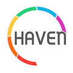
- Organization Structure of Haven (text), with description and contact info for each suborg of Haven
  - Text & image: 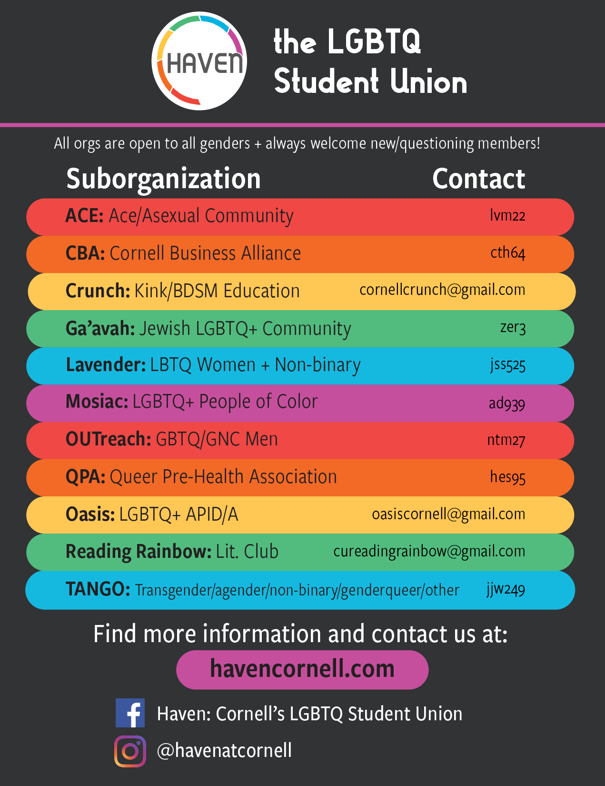
- E-board members of Haven (text & images)
  - Names & Contacts are available on https://www.havencornell.com/
- Upcoming LGBT events/meetings of Haven (text & images)
  - Events are available on https://www.havencornell.com/
- Past popular LGBT events/meetings of Haven (text & images)
  - Events are available on https://www.havencornell.com/
- Resources/Opportunities for LGBT students by Haven/Cornell (text & images)
  - Resources are available on https://www.havencornell.com/
- Subscription/Mailing list to receive events information (form)

## Interactivity Ideas (Milestone 1)
> Come up with some idea for interactive features for your site.

- A "get involved" form that will serve as an informal application to join the executive board of Haven. Prospective members can also get connected with the sub-organizations of Haven via a  subscription or mailing list that LGBT students can sign up and receive events emails weekly so they will not forget about those interesting events

- An image gallery that shows one image at a time and moves to the next image when you click a button

# Design & Evaluation

## Design Process (Milestone 1)
> Document your design process. Show us your card sorting. Design your navigation from the card sorting. Outline your navigation. Describe your theme. Show us sketches of your site (mobile and desktop versions). etc.
> You should show us how your came up with your design and how your iterated on that design; show us the evolution of your design.

> **Note:** Card sorting is used to organize your site's content. For each piece of content identified in the previous section, write a summary of that content onto a card. Now sort the cards. The grouping of cards provides you with your pages for your website. **Do not write down the pages you want and then "card sort" those. That is not card sorting.**

Card sorting iteration 1


Card sorting iteration 2
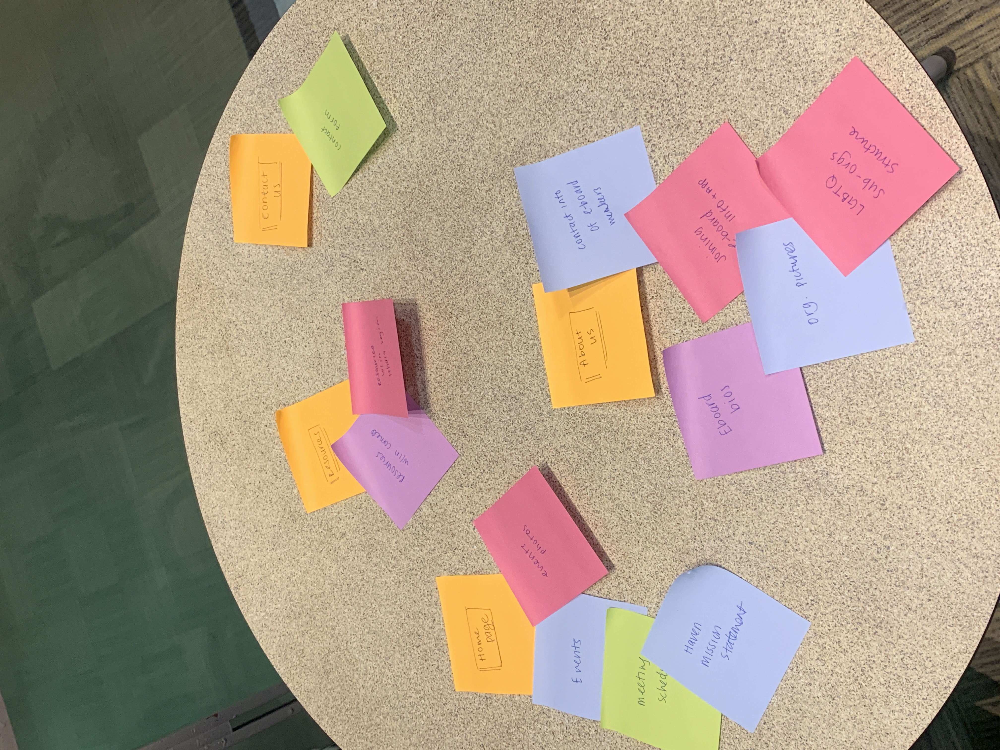

Card sorting iteration 3


First Design iteration - Desktop
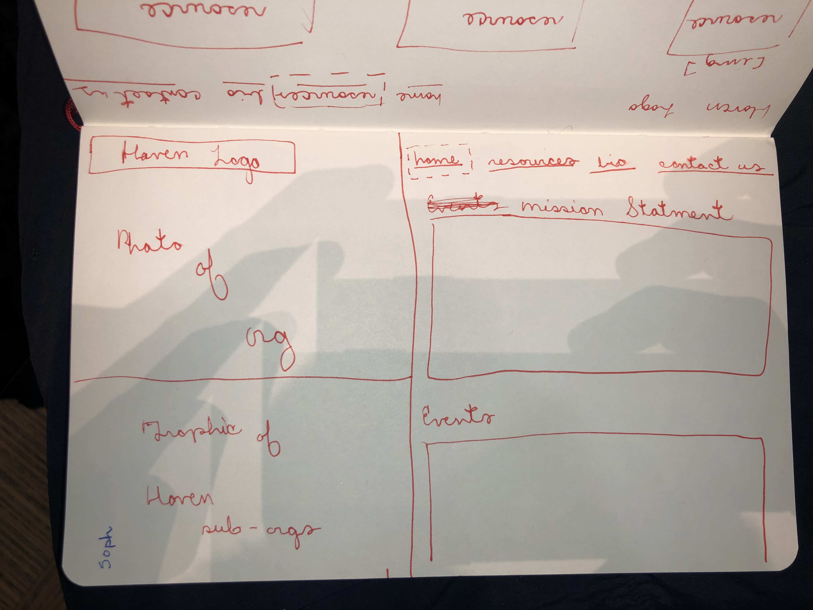
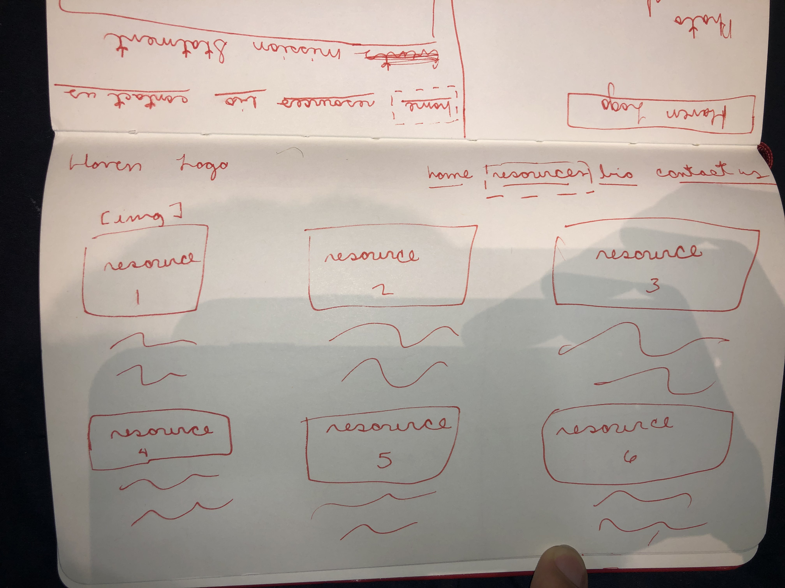
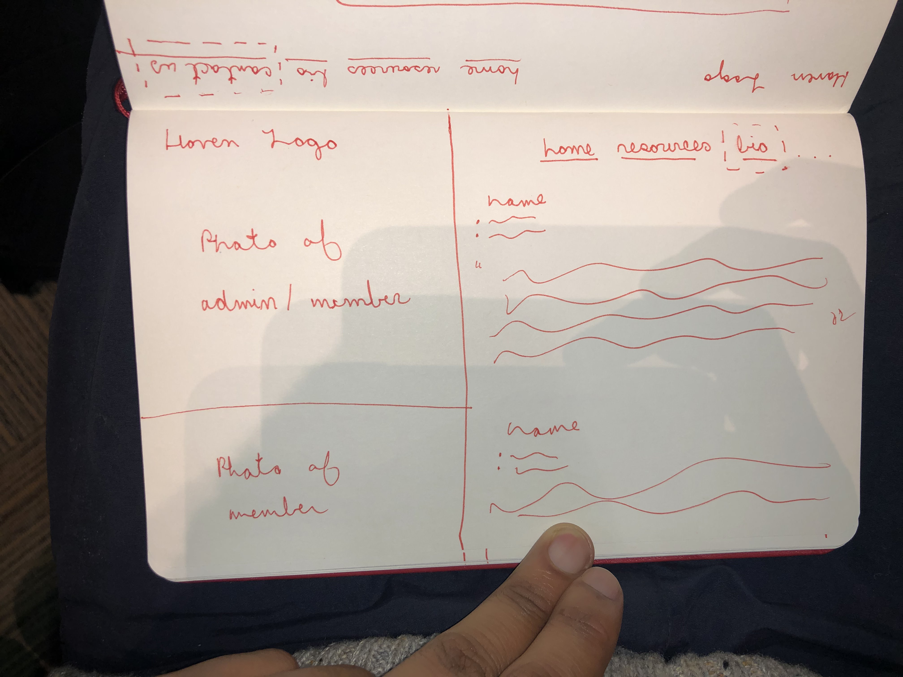
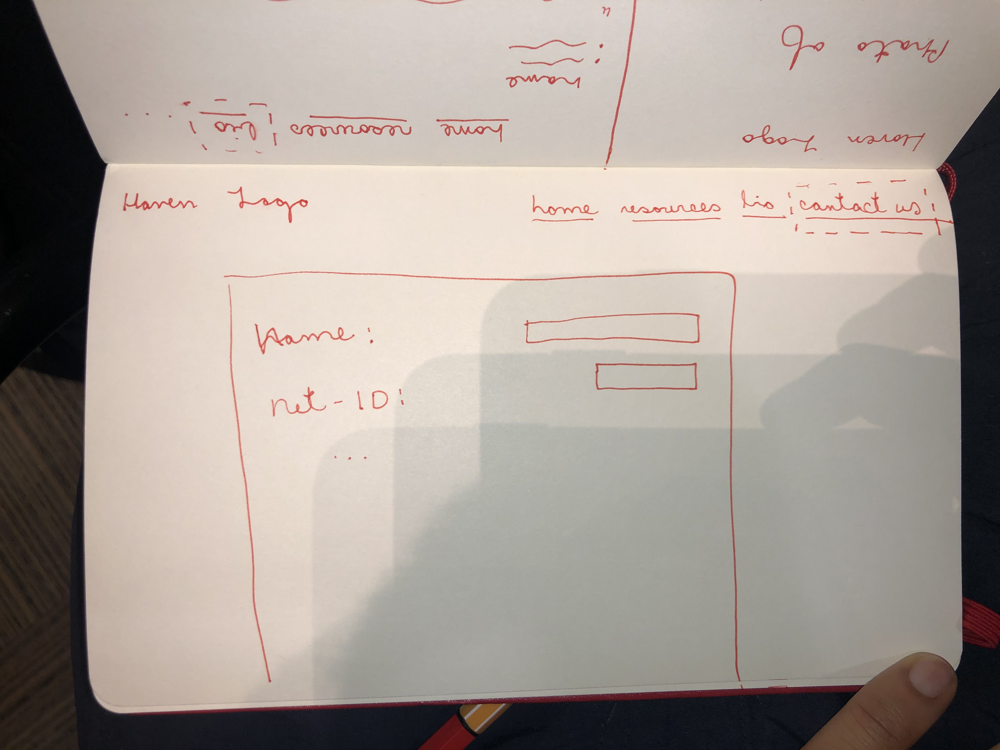

First Design iteration - mobile
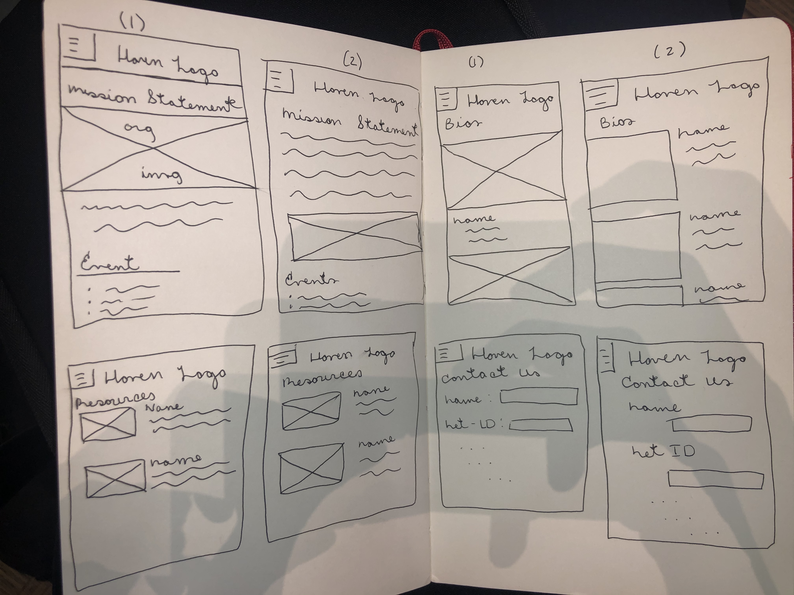
Each page has two different design iterations which is marked as (1) and (2).

First Design Iteration justifications
I chose to separate the page in two half's to make information processing easy for the user. Rather than making the page very information heavy with a lot of text, I decided to add images and graphics to make navigating the pages very easy and calm. The nav bar will be placed at the same level all the way to right of the page while Haven's logo will be placed all the way to the left. This will be exactly the same on every page. The images will take up half of the entire of the page to allow the other side to be filled with content. This design makes the page feel less information heavy and more humanistic.

Theme Justification:
We chose to use a bright pastel based color scheme for the website in order to convey a message of inclusivity and acceptance, which is core to Haven's mission. The colors are also intended to invoke feelings of calmness and optimism in the audience. Organization of the website and subheading accents are all very minimalistic and simple, in order to help allow users to navigate to important resources and links quickly and efficiently, given the sensitivity of some information that the website hosts.
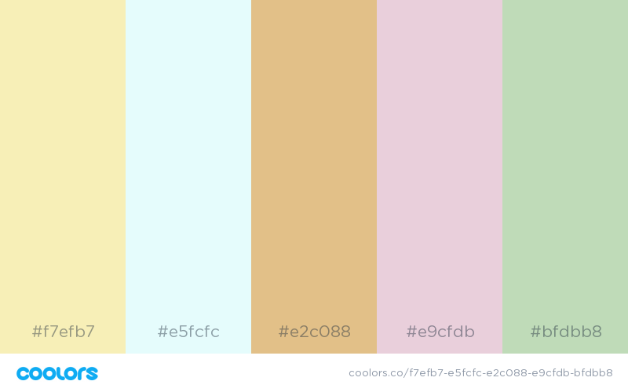


## Interactivity (Milestone 1)
> What interactive features will your site have? Describe how the interactivity connects with the needs of the clients/target audience.

- Subscription mailing list (Form)
  Allowing users to opt in to this feature will make them feel more engaged and more included in the LGBT community. An essential need we identified from our conversation with the client is the primary user's desire to feel like they have a support system within the LGBT community. A mailing list and newsletter will help connect users to each other and offer an organized way for them to be aware of the various events hosted by Haven.

  For maximum usability and better visibility, we will use conditional display of the individual mailing lists for sub-orgs under Haven only after the user selects the radio button indicating that they would like to get connected to mailing lists. Since there are so many sub-orgs and individual lists, we determined that this will help present the wealth of information in a more engaging manner.

- Image Gallery
  Our client needs to appear approachable and show their users who they are as an organization. A photo gallery will help users better understand what Haven does and what they can do to be involved. If you have already been able to see some of the people who come to Haven events in photos, events will seem more familiar to users if they attend.

## User Testing (_optional_)
> This testing is optional.

### User 1 - Testing Notes (Milestone 1)
> When conducting user testing, you should take notes during the test. Place your notes here.


### User 1 (Milestone 1)
> Using your notes from above, describe your user by answering the questions below.

1. Who is your user, e.g., where does the user come from, what is the user's job, characteristics, etc.?


2. Does the user belong to your target audience of the site? (Yes / No)
> If “No”, what’s your strategy of associating the user test results to your target audience’s needs and wants? How can your re-design choices based on the user tests make a better fit for the target audience?


### User 1 - **Desktop** (Milestone 1)
> Report the results of your user's evaluation. You should explain **what the user did**, describe the user's **reaction/feedback** to the design, **reflect on the user's performance**, determine what **re-design choices** you will make. You can also add any additional comments. See the example design journey for an example of what this would look like.

Task: [TODO: copy task here]
- **Did you evaluate the desktop or mobile design?**
  - Pick one: desktop/mobile
- **How did the user do? Did they meet your expectation?**
  - TODO
- **User’s reaction / feedback to the design** (e.g., specific problems or issues found in the tasks)
  - TODO
- **Your reflections about the user’s performance to the task**
  - TODO
- **Re-design choices**
  - TODO
- **Additional Notes**
  - TODO: Justify your decisions; additional notes.

...


### User 2 - Testing Notes (Milestone 1)
> When conducting user testing, you should take notes during the test. Place your notes here.


### User 2 (Milestone 1)
> Using your notes from above, describe your user by answering the questions below.

1. Who is your user, e.g., where does the user come from, what is the user's job, characteristics, etc.?


2. Does the user belong to your target audience of the site? (Yes / No)
> If “No”, what’s your strategy of associating the user test results to your target audience’s needs and wants? How can your re-design choices based on the user tests make a better fit for the target audience?


### User 2 - **Mobile** (Milestone 1)
> Report the results of your user's evaluation. You should explain **what the user did**, describe the user's **reaction/feedback** to the design, **reflect on the user's performance**, determine what **re-design choices** you will make. You can also add any additional comments. See the example design journey for an example of what this would look like.

Task: [TODO: copy task here]
- **Did you evaluate the desktop or mobile design?**
  - Pick one: desktop/mobile
- **How did the user do? Did they meet your expectation?**
  - TODO
- **User’s reaction / feedback to the design** (e.g., specific problems or issues found in the tasks)
  - TODO
- **Your reflections about the user’s performance to the task**
  - TODO
- **Re-design choices**
  - TODO
- **Additional Notes**
  - TODO: Justify your decisions; additional notes.

...

## Final Design (Milestone 1)
> Include the final sketches for each of your pages. These sketches **must** hand-drawn.

**Desktop Design:**
Final Design Iteration


**Mobile Design:**

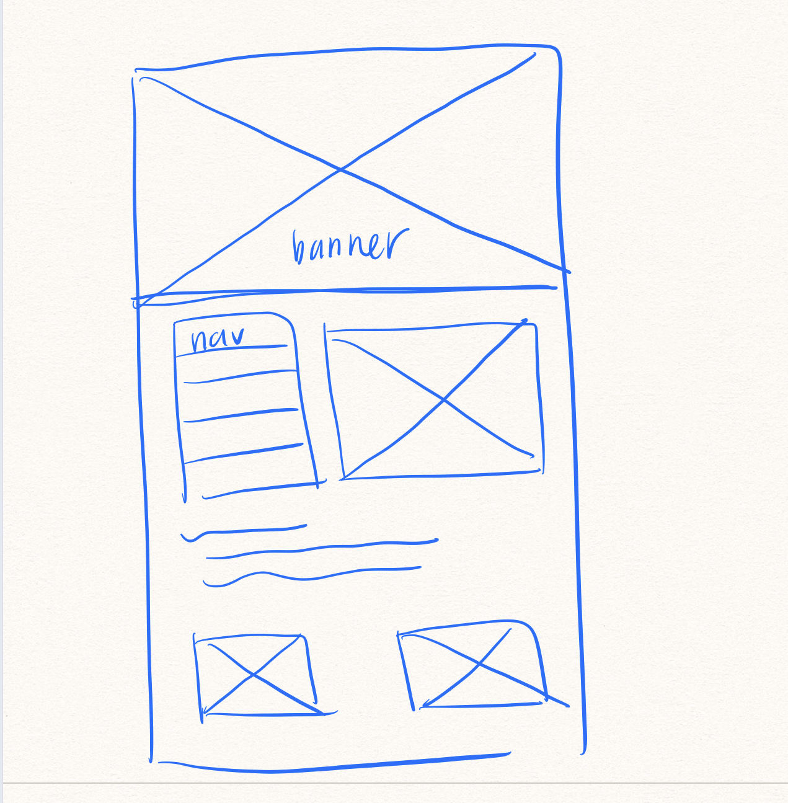
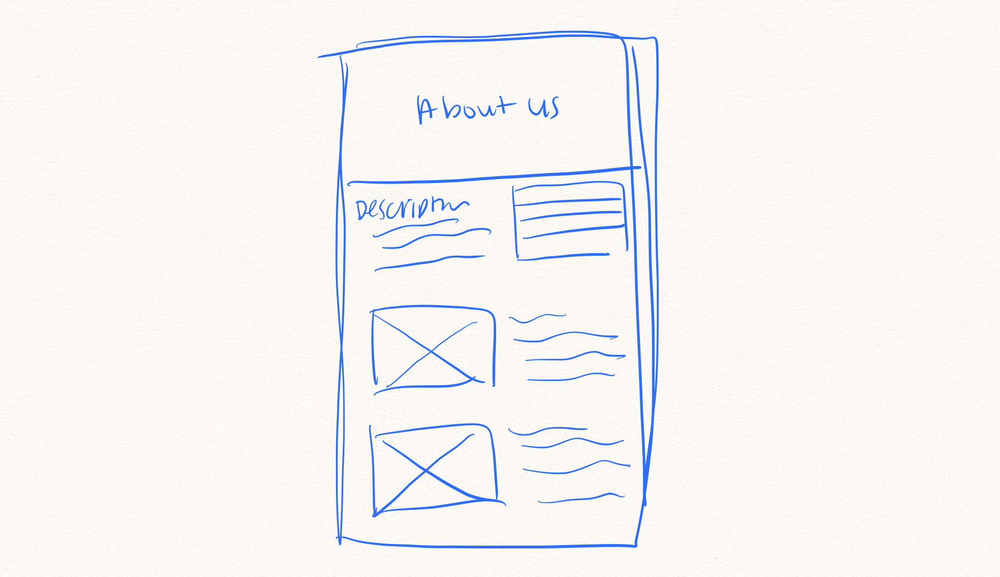
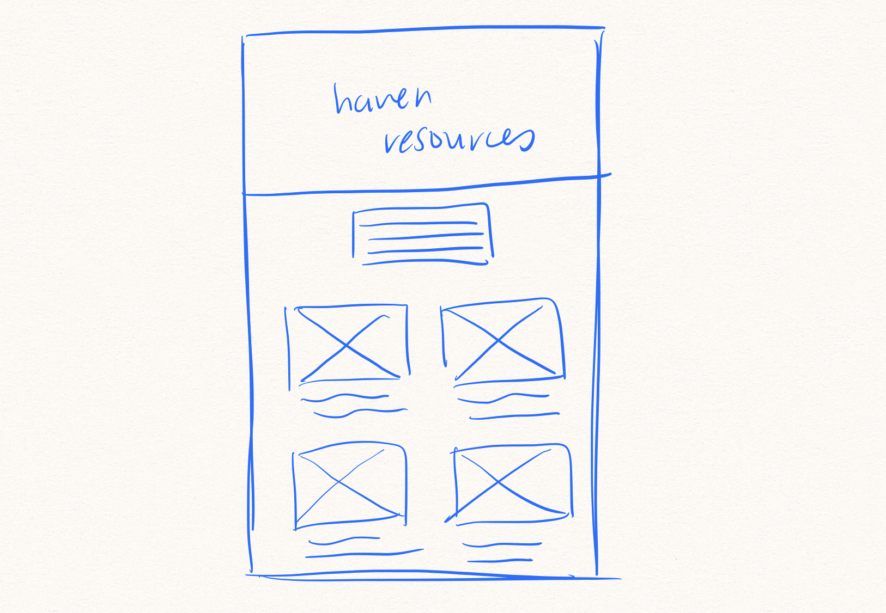


## Additional Comments (Milestone 1)
> If you feel like you haven't fully explained your design choices, or if you want to explain some other functions in your site (such as special design decisions that might not meet the Project 4 requirements), you can use this space to justify your design choices or ask other questions about the project and process.


---

# Iteration 2

## Client Feedback (Milestone 2)
> You have met once with your client a second time to discuss your initial design. Include your notes from the meeting, an email they sent you, or whatever you used to keep track of what was discussed at the meeting. Write a few sentences about the design feedback you received from your client.

**Color scheme**

Did not like the color scheme :(

  Sent some alternatives based on past posters and quartercards:

  Each page could have a white background, gray text, and a different accent color from the haven logo

Color codes:
#34CC81 green
#57585A gray
#FC4541 red
#FC6A21 orange
#FEC753 yellow
#18B8E0 blue
#D644B1 magenta

white

  
  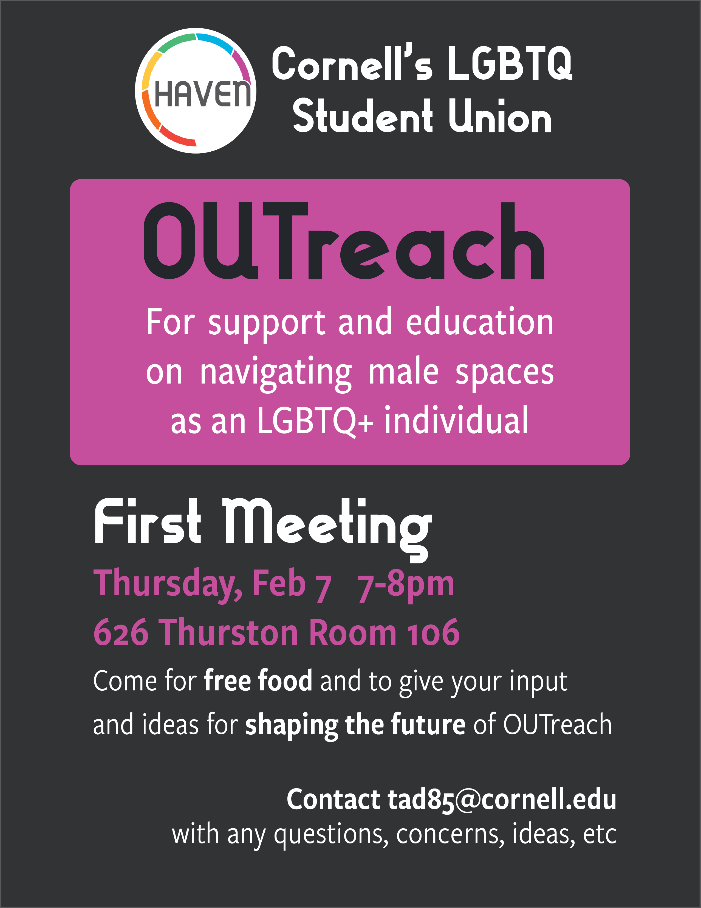

  We could also use a color scheme based on the Queer Month 2019 color scheme

Color codes:
#FFD9D3 light pink background
#8427B8 bright violet
#C74E9D dark magenta
#57585A gray

black

white

  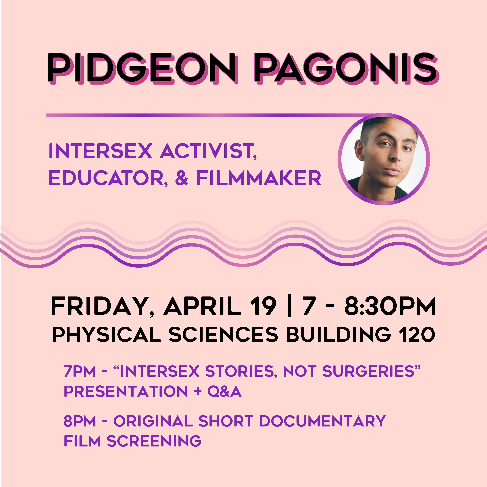

**Nav bar**

*Desktop*
"You can't have two different nav bars"
  The nav bar is different on the different desktop pages, which is inconsistent and confusing

Should it be a top or side nav bar?
  Either would be fine, as long as it doesn't do the thing that the side nav bar does on the current website, where you have to scroll to see all the options if your screen is too short.

"consider making the logo 'home' but just writing 'home' under it really small"

*mobile*
Where is the nav bar? It looks like it moves on different screens in the mobile version as well, which is also confusing

Note from Sophie: It might be ambitious, but I think we should try a hamburger menu for the mobile nav bar (I included sketches below), because we have too many pages for the nav bar to be horizontal, and a vertical nav bar would take up a lot of space. If that doesn't work, we could also try a nav bar that works like a drop-down menu.

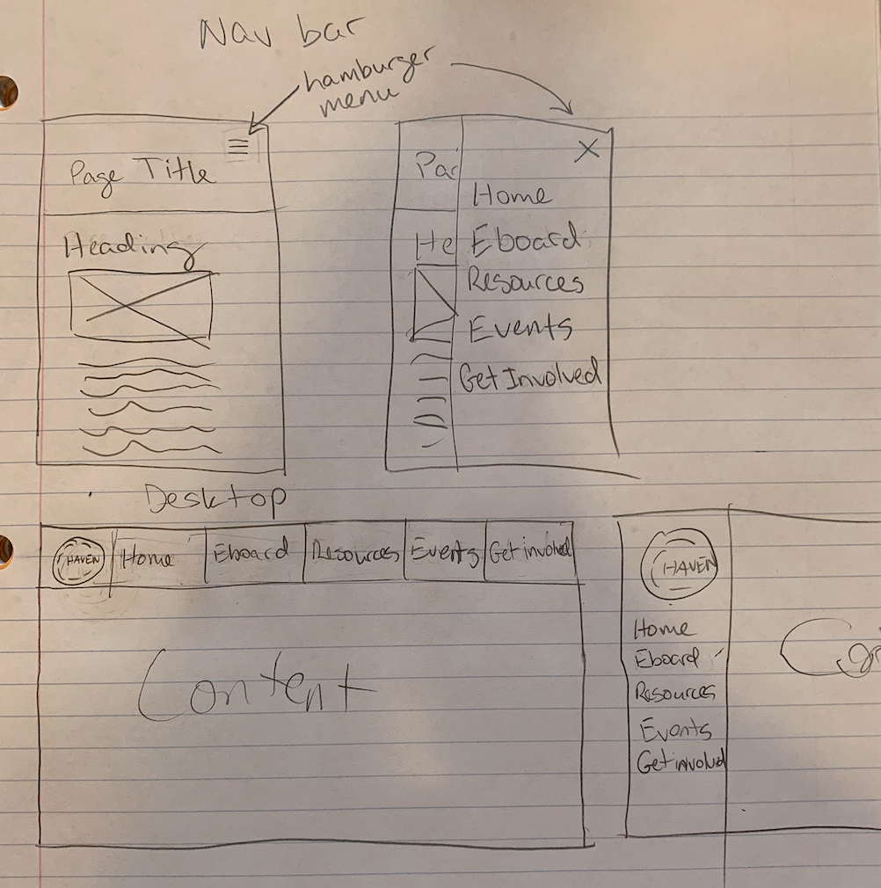

**Page organization**
make the contact us page called "get involved" or something else

"I feel like when I see 'contact us' I think it's going to be an annoying thing that opens up your email"

rename "about us" to "eboard", since people might expect info like the mission statement to be on an "about us" page

**home**

## Interactivity Plan (Milestone 2)
> Write your interactivity pseudocode here.

Example:
```
when DOM is loaded:

  if next is clicked:
    if haven shabbat is visible:
      add hidden class to haven shabbat
      remove hidden class from haven pumpkin
    else if haven pumpkin is visible:
      add hidden class to haven pumpkin
      remove hidden class from haven month
    else if haven month is visible:
      add hidden class to haven month
      remove hidden class from haven coming out
    else if haven coming out is visible:
      add hidden class to haven coming out
      remove hidden class from haven shabbat

```
```
when DOM is loaded:

  if name meets HTML5 validation criteria
    hide feedback
  else
    show feedback
    formvalid <- false

  if email meets HTML5 validation criteria
    hide feedback
  else
    show feedback
    formvalid <- false
  if ACE is checked
    formvalid <-true
  else if CBA is checked
    formvalid <-true
  else if CRUNCH is checked
    formvalid <-true
  else if Ga'avah is checked
    formvalid <-true
  else if Lavender is checked
    formvalid <-true
  else if MOSAIC is checked
    formvalid <-true
  else if Oasis is checked
    formvalid <-true
  else if OUTReach is checked
    formvalid <-true
  else if QPA is checked
    formvalid <-true
  else if Reading Rainbow is checked
    formvalid <-true
  else if T.A.N.G.O. is checked
    formvalid <-true
  else if none of the above is checked
    formvalid <-true
  else
    show feedback
    formvalid <- false

```

## Additional Comments (Milestone 2)
> If you feel like you haven't fully explained your design choices, or if you want to explain some other functions in your site (such as special design decisions that might not meet the Project 4 requirements), you can use this space to justify your design choices or ask other questions about the project and process.


---

# Iteration 3

## Additional Comments (Milestone 3)
> If you feel like you haven't fully explained your design choices, or if you want to explain some other functions in your site (such as special design decisions that might not meet the Project 4 requirements), you can use this space to justify your design choices or ask other questions about the project and process.


---

# Final Evaluation

## Changes Based on Lab 13 Peer Feedback (Final Submission)
> What changes did you make to your design based on your peers' feedback?

- We changed our navigation bar to avoid the small gap on the left side of the navigation bar
- We changed the format of the feedback form to make the questions more aligned
- We changed the event gallery to make it smaller so the audience can easily see the pictures and click the "next" button at the same time

## User Testing
> If you conducted user testing in Milestone 1, you only need to user test 2 more users. Otherwise, you must conduct user testing with 4 users.

### User 3 - Testing Notes (Final Submission)


### User 3 (Final Submission)
> Using your notes from above, describe your user by answering the questions below.

1. Who is your user, e.g., where does the user come from, what is the user's job, characteristics, etc.?
Jalen Wise, Harlem, New York, he is an undergraduate student in Communication major and he identifies as gay male.  

2. Does the user belong to your target audience of the site? (Yes)

### User 3 - **Desktop** (Final Submission)
> Report the results of your user's evaluation. You should explain **what the user did**, describe the user's **reaction/feedback** to the design, **reflect on the user's performance**, determine what **re-design choices** you will make. You can also add any additional comments. See the example design journey for an example of what this would look like.

Task: you are a student who is the publicity chair for BSU and you want to get in contact with Haven, find a way to do that.
- **Did you evaluate the desktop or mobile design?**
  - desktop
- **How did the user do? Did they meet your expectation?**
  - the user did very well, they completed this part very quickly and did not search for anything.
- **User’s reaction / feedback to the design** (e.g., specific problems or issues found in the tasks)
  - the user stated they like the color scheme, no immediate reaction, he did what he had to do
- **Your reflections about the user’s performance to the task**
  - user did great
- **Re-design choices**
  - none
- **Additional Notes**
  - TODO: Justify your decisions; additional notes.

...


### User 4 - Testing Notes (Final Submission)


### User 4 (Final Submission)
> Using your notes from above, describe your user by answering the questions below.

1. Who is your user, e.g., where does the user come from, what is the user's job, characteristics, etc.?
My user is Marie Mendy, she is from San Francisco and is a sophomore in ILR. She knows what haven is but does not know to much about umbrella organizations. She is a straight white woman.

2. Does the user belong to your target audience of the site? (Yes)

### User 4 - **Mobile** (Final Submission)
> Report the results of your user's evaluation. You should explain **what the user did**, describe the user's **reaction/feedback** to the design, **reflect on the user's performance**, determine what **re-design choices** you will make. You can also add any additional comments. See the example design journey for an example of what this would look like.

Task: [find a place on campus that promotes dialogue across cultures]
- **Did you evaluate the desktop or mobile design?**
  - desktop
- **How did the user do? Did they meet your expectation?**
  - the user goes to resources first, scrolls down and find the answer. They met my expectations.
- **User’s reaction / feedback to the design** (e.g., specific problems or issues found in the tasks)
  - the user really liked the gradient. No reaction, did the task thats it
- **Your reflections about the user’s performance to the task**
  - I thought the user navigated that task very well and did exactly what I wanted her to do.
- **Re-design choices**
  - none
- **Additional Notes**
  - TODO: Justify your decisions; additional notes.

...


### User 5 - Testing Notes (Final Submission)


### User 5 (Final Submission)
> Using your notes from above, describe your user by answering the questions below.

1. Who is your user, e.g., where does the user come from, what is the user's job, characteristics, etc.?
My user is Alexa Hyna, they are 20 years old and are a sociology major in CAS. they loves farm animals and is from Florida. They identifies as gender non-binary.  

2. Does the user belong to your target audience of the site? (Yes)
> If “No”, what’s your strategy of associating the user test results to your target audience’s needs and wants? How can your re-design choices based on the user tests make a better fit for the target audience?


### User 5 - **Desktop** (Final Submission)
> Report the results of your user's evaluation. You should explain **what the user did**, describe the user's **reaction/feedback** to the design, **reflect on the user's performance**, determine what **re-design choices** you will make. You can also add any additional comments. See the example design journey for an example of what this would look like.

Task: [find out when queer month was this year.]
- **Did you evaluate the desktop or mobile design?**
  - Pick one: mobile
- **How did the user do? Did they meet your expectation?**
  - the user immediately went to the events page, scrolled up then down then back up and then down, then they found the next button and found the answer. They user somewhat met my expectation, I just did not expect them to take as long to find the next image.
- **User’s reaction / feedback to the design** (e.g., specific problems or issues found in the tasks)
  - The user had not feedback to the design. Did the task...
- **Your reflections about the user’s performance to the task**
  - I thought the user did well, I just wish they did not take so long to go to the next image on the page.
- **Re-design choices**
  - Making the next button more noticeable.
- **Additional Notes**
  - TODO: Justify your decisions; additional notes.

...


### User 6 - Testing Notes (Final Submission)
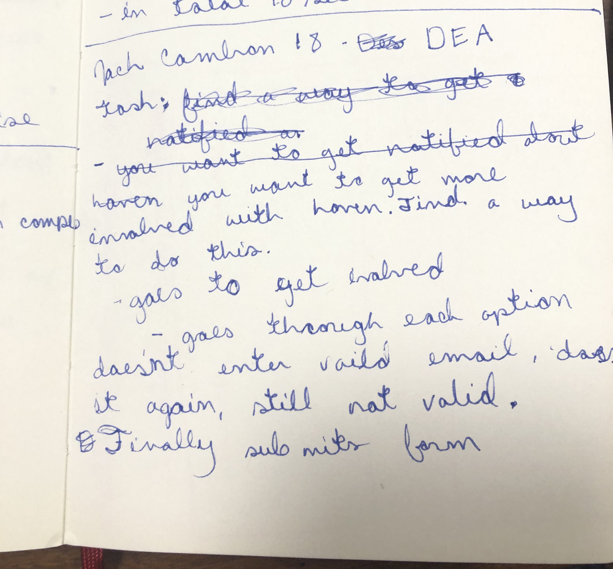


### User 6 (Final Submission)
> Using your notes from above, describe your user by answering the questions below.

1. Who is your user, e.g., where does the user come from, what is the user's job, characteristics, etc.?
My user is Jack Cambron, he is a freshman in Human Ecology studying Design and Environmental Analysis. He is from Washington and has a love for chicken noodle soup. He is a bisexual, Asian male.

2. Does the user belong to your target audience of the site? (Yes)
> If “No”, what’s your strategy of associating the user test results to your target audience’s needs and wants? How can your re-design choices based on the user tests make a better fit for the target audience?


### User 6 - **Mobile** (Final Submission)
> Report the results of your user's evaluation. You should explain **what the user did**, describe the user's **reaction/feedback** to the design, **reflect on the user's performance**, determine what **re-design choices** you will make. You can also add any additional comments. See the example design journey for an example of what this would look like.

Task: [you want to get notified about haven events and projects in the future, find a way to do that.]
- **Did you evaluate the desktop or mobile design?**
  - Pick one: mobile
- **How did the user do? Did they meet your expectation?**
  - The user goes to the get involved page and scans page, he then begins to fill it out and then goes to submit but error message pops up, his email was invalid, he attempts to fix input but then fails. He realizes his mistake and fixes it and finally submits the form.
- **User’s reaction / feedback to the design** (e.g., specific problems or issues found in the tasks)
  - The user loved the purple color,  and no reaction to the task, did not ask me questions, did what he had to do.
- **Your reflections about the user’s performance to the task**
  - I did not expect user to mess up so many times with their email. Other than that, the user did exactly what I wanted them to do, no problem, very easy.
- **Re-design choices**
  - none
- **Additional Notes**
  - TODO: Justify your decisions; additional notes.

...


## Changes Based on User Testing (Final Submission)
One change was the increase in size of the next button on the for the event image gallery on the "Events" page. This is to maximize visibility and increase usability.


## Final Notes to the Graders (Final Submission)
> 1. Give us three specific strengths of your site that sets it apart from the previous website of the client (if applicable) and/or from other websites. Think of this as your chance to argue for the things you did really well.

We have consistently thought about what content and display formats will be most appealing and usable for our users, and tried to improve upon previous design iterations. We have done this by making additional changes such as the form's conditional display of the additional individual mailing list subscription buttons. Due to the large number of sub-orgs and mailing lists, we realized this may make the form seem intimidating and discourage potential members of the LGBTQ community to get connected.

Approachability is one thing consistently emphasized by our client, so we decided to make the mailing list options appear only when the user clicks on the "yes" radio button to connecting with sub-orgs. We routinely check back in with our client more so than required, because we want to ensure we can get as much feedback as possible on recent updates and new features incorporated into the site. We believe our client's requests were well represented in our website, and shows in the small details we took care to implement, such as the color scheme, rounded border corners and balance of white space to text.

We made several design decisions that demonstrates the extra care going into ensuring we have a complete and visually appealing product, and ensuring our client's needs were met. We made original cover photo for our website, and used gradient backgrounds for some of the pages in order to ensure we were maintaining the overall theme of the website while still creating an original product that will make our client more recognizable to the users.

We also improved on the navigation bar from the original client website. On https://www.havencornell.com/, the navigation bar is vertical. The biggest flaw with this nav bar is that if the browser window is not tall enough, it will not display all the pages; the user has to scroll in the navigation bar to see all the options. There is also no cue to indicate that the user can scroll to see more options. Additionally, there is a button that says “Enjoy!” at the bottom that takes up a lot of space and just takes the user back to the “Home” section. We thought this button was redundant, unclear, and taking up space that could have been used to show all the navigation options. We decided that in this situation, simpler is better. For our desktop navigation, we made a horizontal navigation bar that stays fixed at the top of the screen and always shows all of the options.

> 2. Tell us about things that don't work, what you wanted to implement, or what you would do if you keep working with the client in the future. Give justifications.

If we continued to work with the client, we would like to refine the design of our mobile navigation bar. In the current version, our navigation bar is responsive and becomes vertical instead of horizontal to fit more easily on a mobile screen. It also does not stay at a fixed position at the top of the screen the way it does in the desktop version. If we were to continue working with our client, we would consider making the navigation bar collapsible and fixed at the top of the screen, the way the current website is.

We would also like to make a version of the website for our client where their Google calendar is embedded in the events page. We opted to leave out the calendar for now because Haven and it’s suborgs have a lot of events and meetings, and they add things to their schedule regularly. it would be impractical and inconvenient for the client to regularly have to update a calendar that is created solely with html and css, especially when they have a Google calendar that they already use.


> 3. Tell us what you, as a team, learned while working on this project.

We learned that dividing work in the team is really helpful and useful. The meeting before each due date of different milestones is also important and efficient. Everyone in the team is contributing and working for the project. Work as a group means to work together and to help each other.

We also learned that communication is really important, especially when you are using something like GitHub, where you can’t update the files in real time without pushing. We had to make sure we were all on the same page about who was fixing what, so that we didn’t ruin each other’s code. Sometimes we got confused about why someone coded things a certain way (e.g. Why is this in a div? Why did we add margins to this element? etc.), and we had to discuss to make sure we all understood what all of our code did and why it was implemented.

Through our design process, we also learned how to balance our own ideas with the preferences of the client, and respond to feedback while still maintaining good design principles. Many of our changes from the original design sketches in Milestone 1 were changed based on client feedback, like the location of the navigation bar, the color scheme, and the names of the pages. We worked with our client to find a way to change the design so that both we and the client could support it.

> 4. Tell us anything else you need us to know for when we're looking at the project.

We are a team of 4 members (Yunyun Wang, Zeyi Qiu, Sophia Cook, Jonathan Mercedes). There were 5 members assigned to our group, but our fifth member never responded to our communication and did not participate in the project.
